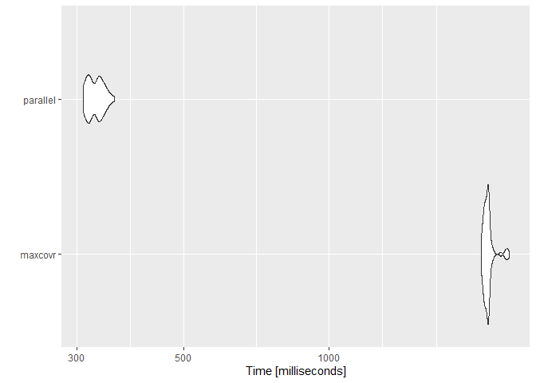

<!-- README.md is generated from README.Rmd. Please edit that file -->

# Using RcppParallel to calculate distance matrices proof of concept

<!-- badges: start -->

<!-- badges: end -->

``` r
# devtools::install_github("njtierney/maxcovr")
library(geodist)
#> Warning: package 'geodist' was built under R version 3.6.1
library(maxcovr)
library(microbenchmark)
#> Warning: package 'microbenchmark' was built under R version 3.6.1
library(ggplot2)
library(geosphere)
#> Warning: package 'geosphere' was built under R version 3.6.1
Rcpp::sourceCpp("pargeodist.cpp")
```

``` r
# Create some dummy data to use in calculations
set.seed(10)
n <- 500
x <- cbind (-10 + 20 * stats::runif (n), -10 + 20 * stats::runif (n))
y <- cbind (-10 + 20 * stats::runif (2 * n), -10 + 20 * stats::runif (2 * n))
colnames (x) <- colnames (y) <- c ("x", "y")

geodist_res <- geodist::geodist(x, y, measure = "haversine")
maxcovr_res <- maxcovr::distance_matrix_cpp(y, x)
geosphere_res <- geosphere::distm(x, y, fun = geosphere::distHaversine)
parallel_res <- rcpp_parallel_distm_C(x, y) * 1609.34

all.equal(geodist_res, parallel_res)
#> [1] TRUE
all.equal(geodist_res, maxcovr_res)
#> [1] "Mean relative difference: 0.002942463"
all.equal(maxcovr_res, parallel_res)
#> [1] "Mean relative difference: 0.002945609"
all.equal(geodist_res, geosphere_res)
#> [1] TRUE
all.equal(parallel_res, geosphere_res)
#> [1] TRUE

mb1 <-
  microbenchmark(
    geodist = geodist::geodist(x, y, measure = "haversine"),
    maxcovr = maxcovr::distance_matrix_cpp(y, x),
    geosphere = geosphere::distm(x, y, fun = geosphere::distHaversine),
    parallel = rcpp_parallel_distm_C(x, y) * 1609.34
  )

mb1
#> Unit: milliseconds
#>       expr      min        lq      mean    median        uq      max neval
#>    geodist  79.3119  81.51795  84.23601  83.22715  85.87190  96.8486   100
#>    maxcovr 102.2604 104.95745 107.80507 107.15460 109.47490 126.8321   100
#>  geosphere 277.8045 298.83525 309.32841 304.75940 314.64495 380.7904   100
#>   parallel  16.7408  18.40445  20.13599  19.68725  21.42175  27.9256   100
#>   cld
#>   b  
#>    c 
#>     d
#>  a

autoplot(mb1)
```

<!-- -->

# Comparing to maxcovr::nearest\_facility\_dist functionality

``` r
set.seed(10)
n_users <- 5000
n_sites <- 25
x <- cbind (-10 + 20 * runif (n_users), -10 + 20 * runif (n_users))
y <- cbind (-10 + 20 * runif (2 * n_sites), -10 + 20 * runif (2 * n_sites))
colnames (x) <- colnames (y) <- c ("x", "y")

microbenchmark::microbenchmark(
  maxcovr = maxcovr::distance_matrix_cpp(y, x),
  parallel = rcpp_parallel_distm_C(x, y) * 1609.34)
#> Unit: milliseconds
#>      expr       min        lq     mean   median       uq      max neval
#>   maxcovr 51.341601 52.568402 55.99251 54.44965 57.78535 105.2437   100
#>  parallel  8.576401  9.726651 11.13727 10.46235 11.55280  19.3391   100
#>  cld
#>    b
#>   a

head(maxcovr::nearest_facility_dist(y, x))
#>      [,1] [,2]      [,3]
#> [1,]    1    2  11377.15
#> [2,]    2    6  41884.89
#> [3,]    3   50 183700.33
#> [4,]    4    4  79928.23
#> [5,]    5   37 190458.37
#> [6,]    6   35 120671.06

# This only returns the identifier of which site was closest, but could
# be modified to include the same information as what is provided above
head(rcpp_parallel_distm_C_min(x, y, 5000))
#> [1]  2  6 50  4 37 35

mb2 <- microbenchmark::microbenchmark(
  maxcovr = maxcovr::nearest_facility_dist(y, x),
  parallel = rcpp_parallel_distm_C_min(x, y, 5000)
)

mb2
#> Unit: milliseconds
#>      expr       min        lq     mean    median       uq     max neval
#>   maxcovr 51.748402 53.370051 56.34748 54.832851 57.62935 75.2227   100
#>  parallel  7.772801  8.901651 10.03308  9.272401 10.54020 25.3230   100
#>  cld
#>    b
#>   a

autoplot(mb2)
```

<!-- -->
