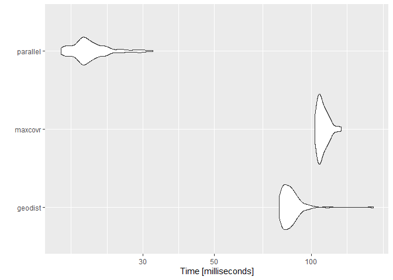
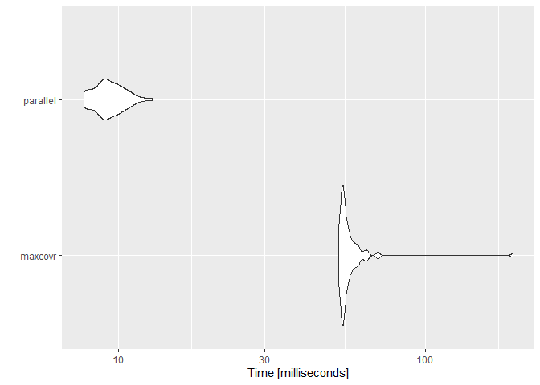

<!-- README.md is generated from README.Rmd. Please edit that file -->


# Using RcppParallel to calculate distance matrices proof of concept

<!-- badges: start -->
<!-- badges: end -->


```r
# devtools::install_github("njtierney/maxcovr")
library(geodist)
#> Warning: package 'geodist' was built under R version 3.6.1
library(maxcovr)
library(microbenchmark)
#> Warning: package 'microbenchmark' was built under R version 3.6.1
library(ggplot2)
Rcpp::sourceCpp("pargeodist.cpp")
```


```r
# Create some dummy data to use in calculations
set.seed(10)
n <- 500
x <- cbind (-10 + 20 * stats::runif (n), -10 + 20 * stats::runif (n))
y <- cbind (-10 + 20 * stats::runif (2 * n), -10 + 20 * stats::runif (2 * n))
colnames (x) <- colnames (y) <- c ("x", "y")

geodist_res <- geodist::geodist(x, y, measure = "haversine")
maxcovr_res <- maxcovr::distance_matrix_cpp(y, x)
parallel_res <- rcpp_parallel_distm_C(x, y) * 1609.34

all.equal(geodist_res, parallel_res)
#> [1] TRUE
all.equal(geodist_res, maxcovr_res)
#> [1] "Mean relative difference: 0.002942463"
all.equal(maxcovr_res, parallel_res)
#> [1] "Mean relative difference: 0.002945609"

mb1 <-
  microbenchmark(
    geodist = geodist::geodist(x, y, measure = "haversine"),
    maxcovr = maxcovr::distance_matrix_cpp(y, x),
    parallel = rcpp_parallel_distm_C(x, y) * 1609.34
  )

mb1
#> Unit: milliseconds
#>      expr      min       lq      mean    median       uq      max neval
#>   geodist  79.5630  82.1982  86.76377  85.16420  88.7041 155.2231   100
#>   maxcovr 102.4296 105.0365 108.51723 107.39865 110.8907 123.7042   100
#>  parallel  16.7178  19.2694  20.83157  20.01875  21.6586  32.2859   100
#>  cld
#>   b 
#>    c
#>  a

autoplot(mb1)
#> Coordinate system already present. Adding new coordinate system, which will replace the existing one.
```

<!-- -->

# Comparing to maxcovr::nearest_facility_dist functionality

```r
set.seed(10)
n_users <- 5000
n_sites <- 25
x <- cbind (-10 + 20 * runif (n_users), -10 + 20 * runif (n_users))
y <- cbind (-10 + 20 * runif (2 * n_sites), -10 + 20 * runif (2 * n_sites))
colnames (x) <- colnames (y) <- c ("x", "y")

microbenchmark::microbenchmark(
  maxcovr = maxcovr::distance_matrix_cpp(y, x),
  parallel = rcpp_parallel_distm_C(x, y) * 1609.34)
#> Unit: milliseconds
#>      expr       min        lq     mean    median       uq     max neval
#>   maxcovr 50.598100 51.940251 53.77143 53.013651 54.34230 64.8376   100
#>  parallel  8.389302  8.841001 10.40200  9.817352 11.10745 19.3569   100
#>  cld
#>    b
#>   a

head(maxcovr::nearest_facility_dist(y, x))
#>      [,1] [,2]      [,3]
#> [1,]    1    2  11377.15
#> [2,]    2    6  41884.89
#> [3,]    3   50 183700.33
#> [4,]    4    4  79928.23
#> [5,]    5   37 190458.37
#> [6,]    6   35 120671.06

# This only returns the identifier of which site was closest, but could
# be modified to include the same information as what is provided above
head(rcpp_parallel_distm_C_min(x, y, 5000))
#> [1]  2  6 50  4 37 35

mb2 <- microbenchmark::microbenchmark(
  maxcovr = maxcovr::nearest_facility_dist(y, x),
  parallel = rcpp_parallel_distm_C_min(x, y, 5000)
)

mb2
#> Unit: milliseconds
#>      expr       min        lq      mean    median       uq      max neval
#>   maxcovr 52.066001 53.681801 57.145090 54.248851 56.77215 192.4461   100
#>  parallel  7.708301  8.761501  9.405707  9.228851 10.04175  12.9094   100
#>  cld
#>    b
#>   a

autoplot(mb2)
#> Coordinate system already present. Adding new coordinate system, which will replace the existing one.
```

<!-- -->
